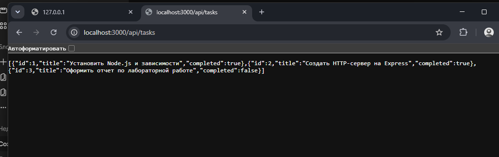
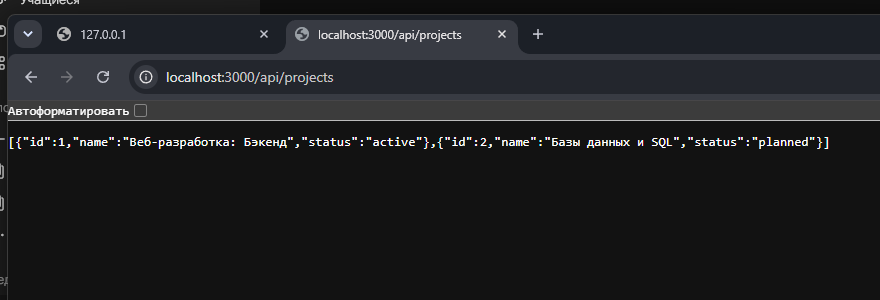
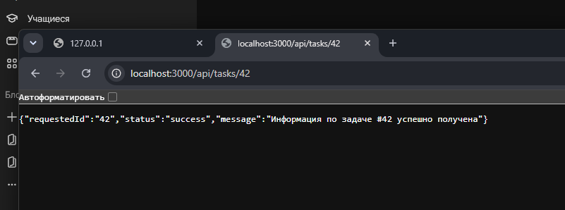
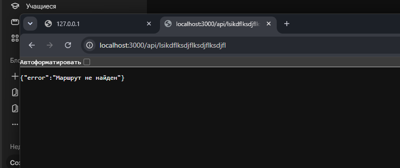
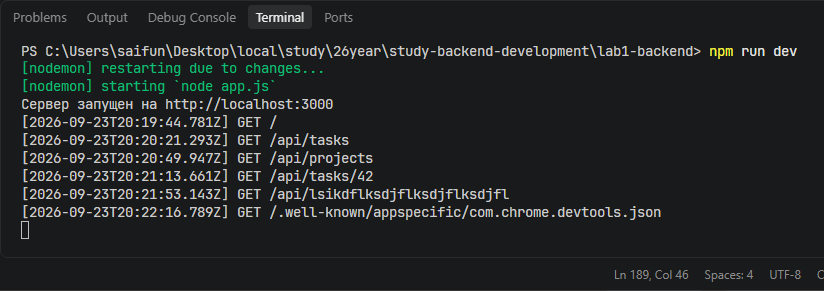

# Лабораторная работа №1: Настройка среды разработки и первый HTTP-сервер

**Студент:** Гаджиев Магомед Исламович  
**Группа:** ПИЖ-б-о-25-2 (2) 
**Вариант:** 1 (Повышенный уровень)  
**Технология:** Node.js + Express  

---

## Содержание
1. [Цель работы](#цель-работы)
2. [Теоретическое обоснование](#теоретическое-обоснование)
3. [Структура проекта](#структура-проекта)
4. [Код сервера и конфигурация](#код-сервера-и-конфигурация)
5. [Инструкция по установке и запуску](#инструкция-по-установке-и-запуску)
6. [Команды для тестирования (cURL)](#команды-для-тестирования-curl)
7. [Скриншоты выполнения](#скриншоты-выполнения)
8. [Ответы на контрольные вопросы](#ответы-на-контрольные-вопросы)
9. [Вывод](#вывод)
10. [Список использованных источников](#список-использованных-источников)

---

## Цель работы
Освоить установку инструментов для бэкенд-разработки, создать и запустить минимальный веб-сервер, обрабатывающий GET-запросы, понять концепцию маршрутизации и эндпоинтов, настроить автоперезапуск сервера с помощью `nodemon`, реализовать логирование входящих запросов и кастомную обработку ошибки 404.

---

## Теоретическое обоснование

### 1. Клиент-серверная архитектура
В веб-разработке взаимодействие строится по модели «клиент-сервер». Клиент (браузер, мобильное приложение или консольная утилита) отправляет HTTP-запрос на сервер. Серверная часть (бэкенд) принимает запрос, выполняет необходимую бизнес-логику, обращается к данным и возвращает клиенту HTTP-ответ с цифровым статус-кодом и телом сообщения.

### 2. Протокол HTTP, метод GET и эндпоинты
HTTP — протокол передачи данных прикладного уровня. Метод `GET` используется исключительно для запроса и получения данных с сервера, являясь безопасным и идемпотентным (не изменяет состояние системы при повторных вызовах). Эндпоинт (endpoint) представляет собой маршрут (URL) в сочетании с конкретным методом HTTP, сопоставленный с функцией-обработчиком на стороне сервера.

### 3. Формат JSON и автоперезапуск
JSON (JavaScript Object Notation) — универсальный текстовый формат обмена данными, основанный на парах «ключ-значение» и массивах. В связке Node.js + Express JSON является стандартным форматом ответов REST API. Для непрерывной разработки применяется инструмент `nodemon`, который отслеживает правки в файлах проекта и автоматически перезапускает процесс Node.js без ручного вмешательства.

---

## Структура проекта

```text
lab1-backend/
├── node_modules/         # Сторонние зависимости
├── screenshots/          # Снимки работы эндпоинтов
│   ├── 01_root.png
│   ├── 02_tasks.png
│   ├── 03_projects.png
│   ├── 04_task_param.png
│   ├── 05_404_error.png
│   └── 06_terminal_logger.png
├── app.js                # Исходный код сервера
├── package.json          # Описание проекта и скрипты запуска
└── README.md             # Отчёт по лабораторной работе
```

---

## Код сервера и конфигурация

### `package.json`
```json
{
  "name": "lab1-backend",
  "version": "1.0.0",
  "description": "Лабораторная работа №1 - Вариант 1 (Повышенный уровень)",
  "main": "app.js",
  "scripts": {
    "start": "node app.js",
    "dev": "nodemon app.js"
  },
  "dependencies": {
    "express": "^4.21.2"
  },
  "devDependencies": {
    "nodemon": "^3.1.14"
  }
}
```

### `app.js`
```javascript
const express = require('express');
const app = express();
const port = 3000;

// Консольное логирование каждого входящего запроса (время, метод, путь)
app.use((req, res, next) => {
  console.log(`[${new Date().toISOString()}] ${req.method} ${req.url}`);
  next();
});

// 1. Корневой текстовый маршрут (Вариант 1)
app.get('/', (req, res) => {
  res.send('Добро пожаловать!');
});

// 2. Коллекция 1: Задачи (JSON)
app.get('/api/tasks', (req, res) => {
  res.json([
    { id: 1, title: 'Установить Node.js и зависимости', completed: true },
    { id: 2, title: 'Реализовать маршруты на Express', completed: true },
    { id: 3, title: 'Подготовить отчет и скриншоты', completed: false }
  ]);
});

// 3. Коллекция 2: Проекты (JSON)
app.get('/api/projects', (req, res) => {
  res.json([
    { id: 1, name: 'Веб-разработка: Бэкенд', status: 'active' },
    { id: 2, name: 'Базы данных и SQL', status: 'planned' }
  ]);
});

// 4. Параметризованный эндпоинт по ID задачи
app.get('/api/tasks/:id', (req, res) => {
  res.json({
    requestedId: req.params.id,
    status: 'success',
    message: `Данные по задаче #${req.params.id} успешно получены`
  });
});

// 5. Обработчик несуществующих маршрутов (404 Not Found)
app.use((req, res) => {
  res.status(404).json({
    error: 'Маршрут не найден'
  });
});

// Запуск прослушивания порта
app.listen(port, () => {
  console.log(`Сервер запущен на http://localhost:${port}`);
});
```

---

## Инструкция по установке и запуску

```bash
# 1. Клонировать репозиторий или перейти в папку с работой
cd lab1-backend

# 2. Установить библиотеки (Express и Nodemon)
npm install

# 3. Запустить сервер в режиме Hot Reload
npm run dev
```

---

## Команды для тестирования (cURL)

```bash
# Проверка корневого ответа
curl -i http://localhost:3000/

# Запрос списка задач
curl -i http://localhost:3000/api/tasks

# Запрос списка проектов
curl -i http://localhost:3000/api/projects

# Запрос задачи с ID 42
curl -i http://localhost:3000/api/tasks/42

# Запрос несуществующего пути
curl -i http://localhost:3000/api/unknown-route
```

---

## Скриншоты выполнения

### 1. Текстовый корневой ответ (`/`)


### 2. Коллекция 1 (`/api/tasks`)


### 3. Коллекция 2 (`/api/projects`)


### 4. Параметризованный маршрут (`/api/tasks/42`)


### 5. Обработка ошибки 404


### 6. Консольное логирование запросов


---

## Ответы на контрольные вопросы

1. **Что такое клиент-серверная архитектура?**  
   Это модель взаимодействия, в которой функционал распределен между поставщиком ресурсов/услуг (сервером) и их потребителем (клиентом). Клиент инициирует запросы, а сервер их обрабатывает и отсылает ответ.

2. **Какой протокол используется для общения клиента и сервера в вебе?**  
   Протокол передачи гипертекста HTTP (HyperText Transfer Protocol) и его защищенная версия HTTPS.

3. **Что такое эндпоинт (endpoint)?**  
   Это точка доступа к ресурсу сервера, определяемая уникальным сетевым адресом (URL) и используемым методом HTTP.

4. **Какую структуру имеет HTTP-запрос и HTTP-ответ? Что такое код состояния (status code)?**  
   - Запрос включает стартовую строку (метод, URL, версию HTTP), заголовки и необязательное тело.
   - Ответ включает статусную строку (версию HTTP, код состояния, пояснение), заголовки и тело ответа.
   - Код состояния — трехзначное число, отражающее статус операции (2xx — успешно, 4xx — ошибка клиента, 5xx — ошибка сервера).

5. **Что такое JSON? Почему он популярен в веб-разработке?**  
   JSON — текстовый формат для представления структурированных данных. Популярен благодаря компактности, универсальности и прямой совместимости с объектами JavaScript.

6. **Что такое автоматический перезапуск сервера и зачем он нужен? Какой пакет используется для Node.js?**  
   Это функция слежения за изменениями в файлах, автоматически перезапускающая серверный процесс при сохранении кода. Для Node.js используется пакет `nodemon`.

7. **Какие коды состояния HTTP вы знаете? За что отвечает код 404?**  
   `200 OK`, `201 Created`, `400 Bad Request`, `401 Unauthorized`, `403 Forbidden`, `404 Not Found`, `500 Internal Server Error`. Код `404` сообщает, что ресурс по заданному URL не найден на сервере.

8. **Что такое middleware в Express?**  
   Это функции промежуточной обработки, выполняющиеся последовательно в цепочке обработки запроса и имеющие доступ к объектам `req`, `res` и функции передачи управления `next()`.

9. **Как получить параметр из URL-пути в Express?**  
   С помощью синтаксиса двоеточия в пути маршрута (например, `/api/tasks/:id`) и последующего обращения к объекту `req.params.id`.

---

## Вывод
В ходе выполнения лабораторной работы была подготовлена рабочая среда на базе Node.js и фреймворка Express. Создан сервер, поддерживающий возврат текстовых и JSON-данных по Варианту 1 повышенного уровня. Настроен автоперезапуск через `nodemon`, добавлен middleware для сквозного логирования запросов, реализована динамическая маршрутизация по идентификатору и кастомный перехват ошибки 404.

---

## Список использованных источников
1. [Документация Express.js](https://expressjs.com/)
2. [Документация Node.js](https://nodejs.org/en/docs/)
3. [Спецификация HTTP (MDN Web Docs)](https://developer.mozilla.org/ru/docs/Web/HTTP)
4. [Документация Nodemon](https://nodemon.io/)