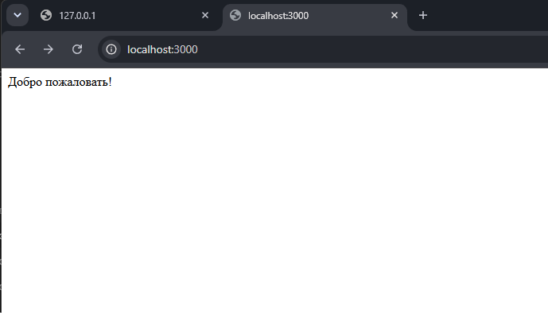

# Лабораторная работа №1: Настройка среды разработки и первый HTTP-сервер

**Студент:** [Фамилия Имя Отчество]  
**Группа:** [Номер группы]  
**Вариант:** [Номер варианта] (Продвинутый уровень)  
**Технологический стек:** Node.js + Express  

---

## Содержание
1. [Цель работы](#цель-работы)
2. [Теоретическое обоснование](#теоретическое-обоснование)
3. [Структура проекта и команды запуска](#структура-проекта-и-команды-запуска)
4. [Код сервера](#код-сервера)
5. [Результаты тестирования и скриншоты](#результаты-тестирования-и-скриншоты)
6. [Тестирование через cURL](#тестирование-через-curl)
7. [Ответы на контрольные вопросы](#ответы-на-контрольные-вопросы)
8. [Вывод](#вывод)
9. [Список использованных источников](#список-использованных-источников)

---

## Цель работы
Освоить установку и настройку инструментов окружения для бэкенд-разработки, создать и запустить минимальный веб-сервер, обрабатывающий HTTP-запросы методом `GET`, изучить концепцию маршрутизации и эндпоинтов, реализовать логирование и обработку ошибок (код 404), а также настроить автоматический перезапуск сервера (Hot Reload).

---

## Теоретическое обоснование

**Бэкенд-разработка и клиент-серверная архитектура.**  
Бэкенд представляет собой серверную часть веб-приложения, выполняющуюся на стороне сервера и скрытую от конечного пользователя. В основе взаимодействия лежит архитектурная модель «клиент-сервер». Клиент (браузер, мобильный клиент, консольная утилита) формирует и отправляет HTTP-запрос по заданному адресу. Сервер принимает запрос, выполняет необходимую бизнес-логику (вычисления, доступ к хранилищам данных) и возвращает HTTP-ответ, содержащий статус выполнения, заголовки и тело ответа.

**Протокол HTTP, методы и эндпоинты.**  
Основным протоколом передачи гипертекста в сети Интернет выступает HTTP. Для безопасного получения данных сервером обрабатываются запросы методом `GET`, обладающим свойством идемпотентности (повторный вызов метода не должен приводить к изменению состояния сервера). Точка входа на сервере, определяемая комбинацией пути (URL-path) и метода (HTTP Verb), называется эндпоинтом (endpoint). Сопоставление входящего адреса с соответствующей функцией-обработчиком называется маршрутизацией (routing).

**Формат JSON и механизм Hot Reload.**  
Стандартом де-факто для обмена данными между современными API и клиентами является текстовый формат JSON (JavaScript Object Notation), обеспечивающий удобное представление объектов и массивов. В процессе разработки постоянный ручной перезапуск процесса сервера снижает продуктивность, поэтому применяется механизм автоматического отслеживания изменений файлов исходного кода (Hot Reload), реализованный для Node.js с помощью пакета `nodemon`.

---

## Структура проекта и команды запуска

### Структура каталога
```text
lab1-first-http-server/
├── node_modules/         # Установленные зависимости (создаются автоматически)
├── screenshots/          # Снимки экрана с результатами тестирования
│   ├── 01_root.png
│   ├── 02_status.png
│   ├── 03_info.png
│   ├── 04_param_user.png
│   ├── 05_not_found_404.png
│   └── 06_terminal_logs.png
├── app.js                # Основной файл логики веб-сервера
├── package.json          # Метаданные проекта и npm-скрипты
├── package-lock.json     # Фиксация точных версий зависимостей
└── README.md             # Отчёт по выполненной работе
```

### Команды инициализации проекта
```bash
# Инициализация Node.js проекта
npm init -y

# Установка Express
npm install express

# Установка nodemon для разработки
npm install --save-dev nodemon
```

### Файл `package.json`
```json
{
  "name": "lab1-backend",
  "version": "1.0.0",
  "description": "Лабораторная работа №1 - Первый HTTP-сервер на Express",
  "main": "app.js",
  "scripts": {
    "start": "node app.js",
    "dev": "nodemon app.js"
  },
  "dependencies": {
    "express": "^4.21.2"
  },
  "devDependencies": {
    "nodemon": "^3.1.14"
  }
}
```

### Команда запуска сервера в режиме разработки
```bash
npm run dev
```

---

## Код сервера

Файл `app.js`:
```javascript
const express = require('express');
const app = express();
const port = 3000;

// 1. Промежуточное ПО (Middleware) для сквозного логирования входящих запросов
app.use((req, res, next) => {
  const timestamp = new Date().toISOString();
  console.log(`[${timestamp}] ${req.method} ${req.url}`);
  next();
});

// 2. Корневой эндпоинт (возврат простого текста)
app.get('/', (req, res) => {
  res.send('Добро пожаловать на базовый сервер!');
});

// 3. JSON-эндпоинт 1: состояние сервера и время аптайма
app.get('/api/status', (req, res) => {
  res.json({
    status: 'ok',
    uptime: process.uptime()
  });
});

// 4. JSON-эндпоинт 2: информация о проекте и авторе
app.get('/api/info', (req, res) => {
  res.json({
    author: 'Student',
    version: '1.0.0'
  });
});

// 5. JSON-эндпоинт с параметром в пути (динамический ID)
app.get('/api/users/:id', (req, res) => {
  res.json({
    message: 'Информация о пользователе',
    userId: req.params.id
  });
});

// 6. Обработка несуществующих маршрутов (Кастомный 404 Not Found)
app.use((req, res) => {
  res.status(404).json({
    error: 'Маршрут не найден'
  });
});

// Запуск прослушивания входящих подключений
app.listen(port, () => {
  console.log(`Сервер запущен на http://localhost:${port}`);
});
```

---

## Результаты тестирования и скриншоты

### 1. Корневой маршрут (`GET /`)
Возвращает приветственное текстовое сообщение:


### 2. Системный статус (`GET /api/status`)
Возвращает JSON с текущим состоянием и временем непрерывной работы процесса:


### 3. Метаданные приложения (`GET /api/info`)
Возвращает JSON с именем автора и версией сборки:


### 4. Параметризированный маршрут (`GET /api/users/:id`)
Считывает идентификатор из пути запроса и отдаёт JSON-ответ:


### 5. Обработка ошибки 404 (`GET /undefined-route`)
Возвращает статус-код 404 и структурированное JSON-сообщение об ошибке:


### 6. Консольный вывод логов запросов и перезапуск Nodemon
Демонстрация перехвата запросов и работы механизма Hot Reload в терминале VS Code:


---

## Тестирование через cURL

Команды для проверки работы сервера из терминала:

```bash
# Проверка корневого маршрута
curl -i http://localhost:3000/

# Проверка эндпоинта со статусом
curl -i http://localhost:3000/api/status

# Проверка эндпоинта с метаданными
curl -i http://localhost:3000/api/info

# Проверка эндпоинта с параметром
curl -i http://localhost:3000/api/users/42

# Проверка обработки несуществующего пути (404)
curl -i http://localhost:3000/api/non-existent
```

---

## Ответы на контрольные вопросы

1. **Что такое клиент-серверная архитектура?**  
   Это концепция сетевого взаимодействия, разделяющая участников на поставщиков ресурсов (серверы) и заказчиков (клиенты). Клиент инициирует запрос, а сервер производит вычисления, обращается к данным и возвращает сформированный результат.

2. **Какой протокол используется для общения клиента и сервера в вебе?**  
   В вебе основным протоколом является HTTP (HyperText Transfer Protocol) и его защищённое расширение HTTPS (HTTP Secure) с шифрованием TLS/SSL.

3. **Что такое эндпоинт (endpoint)?**  
   Эндпоинт — это конкретный адрес ресурса (URL) в сочетании с HTTP-методом (GET, POST, PUT, DELETE), к которому клиент обращается для выполнения определённой операции или получения данных.

4. **Какую структуру имеет HTTP-запрос и HTTP-ответ? Что такое код состояния (status code)?**  
   * **HTTP-запрос:** стартовая строка (метод, путь, версия протокола), заголовки (headers) и опциональное тело (body).  
   * **HTTP-ответ:** строка состояния (версия протокола, код ответа, пояснение), заголовки и тело ответа.  
   * **Код состояния (status code):** трёхзначное число, отражающее результат обработки запроса (1xx — информирование, 2xx — успех, 3xx — перенаправление, 4xx — клиентская ошибка, 5xx — серверная ошибка).

5. **Что такое JSON? Почему он популярен в веб-разработке?**  
   JSON (JavaScript Object Notation) — легковесный текстовый формат представления структурированных данных на основе пар «ключ-значение» и массивов. Он популярен благодаря простоте чтения человеком, компактности и встроенной поддержке сериализации/десериализации практически во всех языках программирования.

6. **Как запустить сервер на Node.js или Flask?**  
   * В Node.js: командой `node app.js` или через npm-скрипт `npm run dev` (при настроенном `nodemon`).  
   * Во Flask: командой `python app.py` (или `flask run`).

7. **Что такое автоматический перезапуск сервера и зачем он нужен? Какой пакет используется для Node.js?**  
   Это механизм, который отслеживает изменения в файлах проекта и автоматически перезапускает процесс сервера без ручного вмешательства разработчика. В Node.js для этого используется пакет `nodemon`.

8. **Какие коды состояния HTTP вы знаете? За что отвечает код 404?**  
   * 200 OK — запрос успешно обработан;  
   * 201 Created — ресурс успешно создан;  
   * 400 Bad Request — некорректный запрос клиента;  
   * 401 Unauthorized — требуется аутентификация;  
   * 403 Forbidden — доступ запрещён;  
   * 404 Not Found — запрошенный ресурс или путь не найден на сервере;  
   * 500 Internal Server Error — внутренняя ошибка сервера.

9. **Что такое middleware в Express / декораторы запросов во Flask?**  
   Это промежуточные функции, через которые проходит поток выполнения HTTP-запроса до того, как он попадёт в финальный обработчик маршрута, либо функции пост-обработки. Они используются для аутентификации, логирования, парсинга тела запроса и модификации объекта ответа.

10. **Как получить параметр из URL-пути (например, ID пользователя) в вашем фреймворке?**  
    * В Express: маршрут объявляется с двоеточием `/api/users/:id`, а значение считывается через свойство объекта `req.params.id`.  
    * Во Flask: маршрут объявляется через угловые скобки `@app.route('/api/users/<int:user_id>')`, и значение передаётся напрямую аргументом в функцию-обработчик `def get_user(user_id)`.

---

## Вывод
В ходе выполнения лабораторной работы были освоены базовые принципы построения бэкенд-приложений на платформе Node.js с использованием веб-фреймворка Express. Были настроены окружение и автоматический перезапуск через утилиту nodemon, реализованы статические и параметризированные эндпоинты, middleware сквозного логирования в консоль, а также настроен перехват неопределённых путей с выдачей ошибки 404 в формате JSON.

---

## Список использованных источников
1. Официальная документация Node.js: [https://nodejs.org/en/docs/](https://nodejs.org/en/docs/)
2. Официальная документация Express.js: [https://expressjs.com/](https://expressjs.com/)
3. Спецификация HTTP на MDN Web Docs: [https://developer.mozilla.org/ru/docs/Web/HTTP](https://developer.mozilla.org/ru/docs/Web/HTTP)
4. Руководство по формату JSON на MDN: [https://developer.mozilla.org/ru/docs/Web/JavaScript/Reference/Global_Objects/JSON](https://developer.mozilla.org/ru/docs/Web/JavaScript/Reference/Global_Objects/JSON)
5. Официальная документация Nodemon: [https://nodemon.io/](https://nodemon.io/)